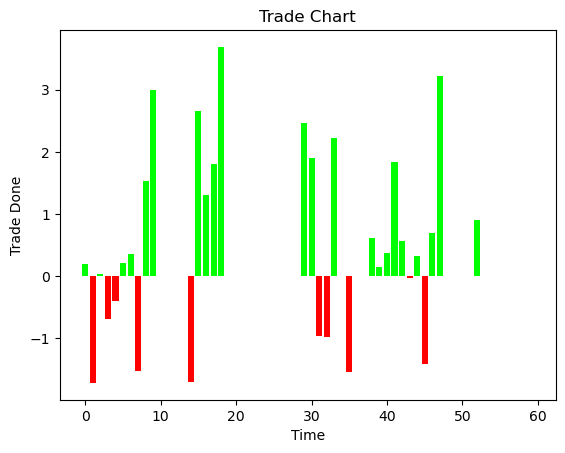

# Apple Stock Price Prediction

## Goal
Predict the last 60 close values of Apple stock using the previous open-close values given and the day's open value.

## Dataset
Dataset given by Yahoo Finance on Apple.

## Description
In this project I created an LSTM based Model to predict the images given.

## Work Done
* Importing pytorch, mathplotlib for the solution
* Creating the function that returns the LSTM based Model
* Importing the data, Splitting the dataset to Train and Test (Validation) data and normalising them.
* Training the model.
* Plotting the accuracy and loss per epoch
* Plotting the close values and checking how close it is to the actual prices.
* Creating a simple trade algorithm to make money.
* Calculate the Profits made and the Percentage of Profit from what could have been made.
* Proving that the High and Low prices of a day does not depend on the Open value of the day.
* Comparing the predicted candlestick with the real candlestick proving that High and Low values are wrong.

## Model Used
### LSTM 

## Libraries used
* pytorch
* Mathplotlib
* os

## Correlation HeatMap

## Loss-Epoch Curve

## Prediction Curve

## Trades Done using a Simple Algorithm
#### Profit Made using just 1 share : $6.6501465
#### Investment used : *(Open Price of the Day)* 

